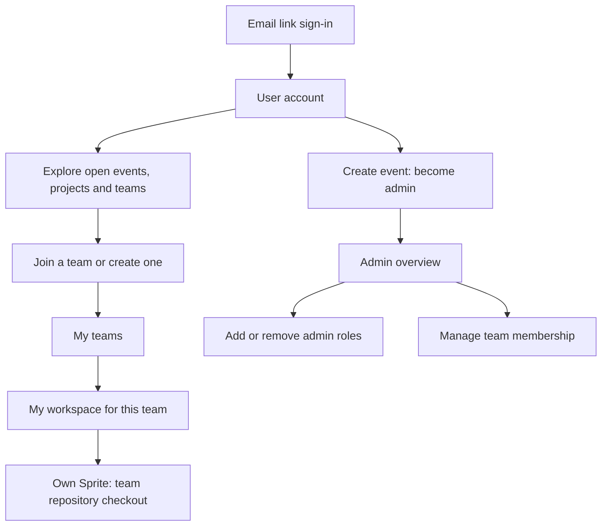

# Accounts, events, teams, and workspaces

## Naming and branding

The repository is `civic-spark` and the platform name is Civic Spark. Participant-facing branding should primarily use the event name, with modest platform identification. Runtime/configuration identifiers use the Civic Spark namespace. This breaks earlier names without compatibility aliases or automatic resource migration; see [migration requirements](rename-migration.md).

## Product model

A **user** normally has a verified email and stable internal identity. The explicit local prototype mode uses the entered email as its identity without verification, with separate data and session cookies. An **event membership** grants member or admin permissions within one event. A **team membership** connects a user to a team; users can have several. A **workspace** belongs to one user/team membership and has its own Sprite and checkout.

## What each person sees

The main portal has a visible **Menu** on phones and short viewports, with Explore projects, Teams, My teams, Schedule and authorized Admin navigation. Explore projects shows the project catalog. Teams lists existing teams in the selected event with project names, member counts and participant names; joining creates a personal membership workspace, and joined teams open only that person’s workspace. The compact list scrolls internally and does not wake runtimes while browsing. My teams retains personal workspace shortcuts and project briefs; Admin → Teams remains separate shared-repository and membership management. Desktop retains its sidebar. The top-bar **Event admin** button opens the admin console; it is available only for the selected event’s existing admin role. The admin console has an overview and Event details, Sprites, Projects, Teams, and People & roles sections in both the sidebar and phone Menu. Overview links directly to each section. Opening or closing Menu does not remount portal content or clear form drafts.

Mobile is a required participant and admin interface. Navigation, event/team management, confirmation dialogs, repository history and restore, browser editing, chat, changes and preview controls should be usable on narrow touch screens and short viewports. Preserve drafts and sessions through responsive layout changes. The terminal remains available with the expected phone keyboard/screen limitations; devices without writable folder access use browser editing or upload/download. Verify phone interactions and both system themes in the browser, while identifying physical iOS/Android keyboard and native-picker checks separately.

Agent and Terminal activate lazily on first opening. Once activated, workspace view switches and menus retain their connections, drafts, transcript and terminal buffer. Transport retries use a bounded backoff independently of view visibility; navigation cannot override denied access or an explicit terminal Disconnect. Reconnect terminal is explicit after Disconnect. A fresh agent workspace checks saved-key presence without starting the agent runtime and asks for a key when none is saved. Existing native saved keys remain reusable without exposing their values.

The five-minute idle policy still releases inactive connections; merely retaining a hidden view does not count as activity. Lifecycle holds, revoked access and signout close connections. Leaving the workspace for the portal still unmounts its browser views; reopening reattaches persisted runtime state, but unsent browser drafts are not persisted across that boundary.

The workspace follows visual-viewport height and panning while preserving native pinch zoom. On phones and short landscape screens, **Menu** exposes Back to teams, team updates and preview controls without remounting the editor, agent or terminal. Composer text scrolls within the remaining chat space. Viewport/keyboard simulations cover these bounds and session/draft retention; actual iPhone keyboard behavior still needs device verification.

| Person | View and permissions |
| --- | --- |
| Signed out | Sign-in page; no event or workspace API data |
| New signed-in user | Open events, projects, existing teams, and create-event option |
| Team member | My teams; join/create additional teams; own private files; shared team changes and ZIP |
| Event admin | Event-wide people/roles/teams/shared work; lifecycle controls; admin grants; team membership removal |

Admin roles do **not** open other people’s private working files. Shared changes and repositories are team-visible. Admins participate through their own team memberships and personal workspaces when they want to work on a project.

### Admin cleanup and repositories

Admin → Teams groups shared repository downloads, history, copy and existing deletion actions by team, alongside confirmed membership removal. It lists all event teams without opening anyone else’s private workspace. Team project reassignment is not offered because existing repositories have their own versioned brief and history. **Repository** opens that team's shared `main` history, with paginated commits, per-file diffs and files at a selected commit. Merge commits compare against their first parent. Private workspace commits and non-main refs are not exposed. Previews exclude protected paths and symlinks and limit each text source to 1 MiB; binary and oversized files show an explicit notice.

- **Remove from event** asks for confirmation, then removes the person's event role and all team memberships in this event. Their account, other events, shared history and saved private work remain. The final admin cannot be removed. This is cleanup, not a ban: the person can rejoin an open event and recover their existing workspace.
- **Delete team** asks for confirmation, then removes the team from discovery and revokes its workspace, repository and export access. Team metadata, the bare repository, local files and Sprites are retained for operator recovery. This does not reclaim cloud resources or provide an in-app undelete flow.
- **Copy team** creates a separately named team with the current shared repository, its history and project brief. No members, private workspace files, credentials or private refs are copied. Participants join the new team normally.
- **Restore this version** asks for confirmation and publishes a new commit whose file tree matches the selected shared commit. Existing history remains intact. The operation rejects a stale expected team HEAD; it never resets or force-pushes shared history. Members receive the restore through normal team-update polling, with their private work preserved.
- **Restore this file** recovers just the selected file from a commit where it existed, after confirmation. It creates a new shared commit and preserves every other current file. Large and binary files can be restored even when no text preview is available. A stale team HEAD, excluded path or file/directory collision blocks the restore without changing shared main.

Repository reads require team membership or event-admin access. Copy, deletion, event-member removal and repository restore require that event's admin role. These use the existing local prototype stores and Git transport; hosted durability and coordinated metadata recovery remain separate work.

## Starting an event

An installation can pin its portal to one existing event with `CIVIC_SPARK_SITE_EVENT_ID` (Fly setup: `siteEventId`). Sign-in, navigation and document title use that event's name; the portal opens its projects directly without cross-event selection or event-creation controls. Admin project/team management remains available. Invalid configuration fails explicitly, and inaccessible draft/closed events do not expose their names to visitors. The underlying multi-event model remains reusable when no event is configured. See [installation configuration](fly-deployment.md).

1. Configure the installation’s email sender and sign-in origin and workspace provider.
2. Sign in and create an event from a blank or DIOD template. The creator becomes its first admin.
3. Add another admin by the verified email of an account that has signed in, or promote an event member. At least one admin must remain.
4. In Admin → Projects, create or edit projects with a name and Markdown brief, including data links. Open registration. Signed-in newcomers see project briefs and teams.
5. Signed-in participants can create a listed project from Projects before joining a team. In the team form, New project opens project creation and returns to the preserved team draft with that project selected; saving the project does not create the team. Creating the team joins its creator and checks the chosen brief into `PROJECT.md`.
6. Rehearse the browser → personal workspace → shared contribution → export path before the event.

### Event details and schedule

Admin → Event details edits the event name, date, timezone, venue/address, participant description, optional start/end times, participant capacity, planned model budget, new-project guidance and schedule. Event identity, template provenance, status, projects, team memberships and participant files remain unchanged. Metadata can also be corrected after closing; only the separate status action changes registration/live/closed state. Capacity cannot be reduced below the current unique active participant count. The budget is a planning amount, not an enforced spending limit.

The existing single-date event model uses local 24-hour start/end times on that date in the selected timezone. End must follow start on the same date; overnight or multi-day intervals are not represented. Schedule rows have stable IDs and editable title, time/label and details, with add/remove and keyboard/touch reorder buttons. Clock times use HH:mm in nondecreasing order (parallel entries are allowed); descriptive labels remain supported. Legacy labels, including clock-like freeform text, survive migration and unrelated edits. Schedule times can include organizer setup outside the advertised event hours. No UTC conversion or automatic event lifecycle change occurs.

Settings require the session's event-admin role and the expected settings revision. Stale writes return 409 and keep the local draft; loading newer details asks before discarding it. Drafts survive closing the editor, section/menu changes and resizing; leaving the event/workspace or signing out asks before discarding. Reload with an unsaved draft uses the browser's unload warning; unsaved drafts are not durable across a confirmed reload. Saved data survives restart in the existing single-writer SQLite store. Legacy events receive neutral optional fields and stable schedule IDs, without replacement from templates. Participant headers, schedule and document titles use saved values; pinned sign-in exposes only the permitted title under the existing draft/closed privacy rules.

New-project guidance is event-scoped plain text (up to 5,000 characters). Missing values default to advice about the problem/audience, outcome/demo, scope, data/access/constraints and success criteria; an explicitly empty value remains empty. This is untrusted participant-facing guidance, not executable content or agent policy, and never rewrites a project brief, template or repository file. The participant project-creation workstream consumes it beside its brief input.

### Project briefs

Signed-in people who can discover a registration/live event can create listed projects before joining a team, including people whose current event role is visitor. Creation does not grant membership or admin rights, create teams/workspaces, consume participant capacity, or start runtime/model work. Draft events retain event-admin-only creation; inaccessible draft/closed events stay private, and visible closed events are read-only. Catalog editing remains event-admin-only. An execution pause blocks runtime work, not catalog creation. Removing membership remains cleanup rather than a ban from an open event.

The project name is 2–100 characters; the Markdown brief is 20–10,000 characters (nonblank after trimming for the minimum). Stored Markdown preserves whitespace and URLs. Event-provided `projectBriefGuidance` is plain-text help beside the brief input, not a second source or automatically submitted content. Project creation refreshes the catalog without reloading. New project in the team form returns on cancel or save with the team draft preserved; only an explicit Create and join team submits that team.

Catalog and team cards render Markdown headings, lists, emphasis, links, code, quotes and GFM tables. Long briefs open in a keyboard-accessible, scrollable disclosure so team actions remain reachable; wide code and tables scroll within the brief. Raw HTML is skipped, unsafe link protocols are filtered, and images display their alternative text without fetching remote content. Rendering does not change stored Markdown or `PROJECT.md`.

`PROJECT.md` is the canonical workspace brief, using the existing event project `description` as its initial source. A requested project “readme” is this brief, not the app's `README.md` or `readme.md`. Team creation commits a title heading followed by the unchanged brief to `PROJECT.md`; it leaves the starter app README intact. Each new team gets the selected project from the same event. Joining a team clones its shared repository, and Copy team copies the shared brief/history rather than anyone's private edits.

Catalog edits require the selected event’s admin role, stable project ID and expected revision. Stale saves return a conflict and retain the browser draft; loading the latest version requires explicit draft-discard confirmation. Names must be unique within the event (case-insensitive). Editing preserves the project ID, tags and exact Markdown. Project and linked team cards display the latest catalog name/brief; newly created teams seed that version. Existing repositories are never rewritten or automatically shared by a catalog update. Project drafts survive section navigation and resizing; switching events, opening a workspace or signing out prompts before discarding unsaved changes. Once seeded, each team's `PROJECT.md` is ordinary versioned project data. Participants update it with revision-checked editing and explicit Share/team updates. Creating another project, reopening a workspace, or reconnecting an agent never rewrites a team's brief or app README. There is no automatic synchronization from catalog metadata into existing team files.

Both browser coding providers and native terminal launchers receive the canonical file reference and guidance to read/re-read it for current context, including resumed work. Markdown and data links are untrusted project data, never harness policy or authority to act. Brief creation and context generation do not fetch links or execute their contents; agents follow links only when relevant to an authorized participant task. See [agent context contracts](workspaces.md#agent-project-guidance-and-environment-commands).

## Day-of workflow

| Stage | Participant | Admin |
| --- | --- | --- |
| Arrival | Open an email sign-in link and choose the event | Monitor people and teams |
| Find a project | Browse briefs and existing teams; join or create one | Help people find teams; correct mistakes |
| Work | Open My teams, then the workspace for a team | Check event-wide progress and shared changes |
| First workspace visit | Sprite is prepared from that team’s committed repository; subsequent visits resume it | Help with failed provisioning |
| Run shared app | Launch prepares supported project dependencies in the personal Sprite, then Open preview runs the shared demo without a model or key | Help with project configuration/install failures |
| Explore/build | Browse and edit files on the personal Sprite; use an agent or optional terminal | Own files remain private even from the admin view |
| Combine | Review Changes, enter a description, and Share directly to the shared team version | Help resolve conflicts and inspect shared results |
| Finish | Export the shared team ZIP; GitHub publishing is planned | Close editing/joining, preserve work, apply retention policy |

A person can move between several teams without losing their separate workspaces. Removing a team membership revokes that workspace access but does not delete its files. This is membership correction, not banning; rejoining restores the workspace while joining is allowed.

## Required workspace modes

These are accepted requirements with a local prototype implementation. Live file/diff, terminal/runner, and a GLM request with approved SVG creation pass; Claude turns and native folder pickers across supported operating systems still need rehearsal. All modes operate on the same personal workspace and retain its owner-only access rules.

| Mode | Required experience |
| --- | --- |
| Browser | Browse and edit files, inspect changes in flight, and use an integrated Claude or OpenCode agent session |
| Terminal | Advanced users can open a browser terminal in their own Sprite and run the interactive agent CLI or other project tools |
| Local folder | Connect a local folder and edit with a preferred desktop editor, with two-way sync through the browser |

The browser agent UI reuses T3 Code components and layout under MIT. Active turns show T3's elapsed-time header, animated Thinking row or latest-tool label; timers survive browser reconnect, animations follow reduced-motion preferences, and completion/stop/errors remove them. Its model choices are fixed to Opus 5 and GLM. Saved credentials remain distinct from runtime readiness: refresh/reconnect retains their presence, settings hide the key input once saved, and a failed provider connection can retry the saved key or replace it. Provider credentials/model settings also configure the native terminal harnesses inside the personal Sprite; both browser and terminal coding run in bypass-permissions mode.

The browser interface remains the default. Terminal and local editing are optional alternatives; participants do not need local Git or SSH setup. Terminal sessions must support reconnection after a page refresh. Agent and terminal commands execute inside the participant's Sprite, never on the management host.

### Changes in flight

- File browsing uses a compact, hierarchical explorer with expandable folders. The sidebar can collapse and resize, retaining the participant's preference without discarding unsaved edits.
- Light/dark appearance follows the system setting, including live changes. The browser code editor uses Monaco’s full filename/extension catalog while preserving the same save and conflict safeguards. HTML, CSS, JavaScript and TypeScript grammars load with the editor so a failed secondary grammar download cannot leave those files permanently uncolored; other grammars load lazily. HTML includes embedded CSS/JavaScript; major web, data, programming, and configuration files are covered. Vue/Svelte use HTML highlighting and TOML uses the bundled INI approximation; unknown file types remain plain text.
- Show added, modified, and deleted files and a diff against the workspace's last synchronized team version.
- Include saved edits from the browser, local editor, terminal, and agent; refresh the view when files change.
- Ordinary `.gitignore` files at the project root or inside visible project directories appear in the editor, Changes and sync. Other hidden paths, credentials and links remain excluded. Share checks every incoming commit and preserves the exact existing native commit when there are no additional edits; an ignore-rule change does not require rewriting history.
- Preserve unsaved browser edits when another source changes the same file and offer reconciliation.
- Syncing a local folder updates only that person's workspace. Sharing changes with the team remains an explicit, separate action.

### Two-way local folder sync

1. The participant selects **Connect local folder**, chooses a folder, and grants browser read/write permission.
2. Offer a fresh folder for the initial project copy. If the selected folder already has files, show a reconciliation preview before writing; never overwrite them silently.
3. Transfer saved project-file changes in both directions between that folder and the personal Sprite through authenticated Civic Spark access.
4. Track the last successful sync and compare both sides against it. Preserve conflicting versions and present a resolution flow when both sides changed a file.
5. Track deletions explicitly. Lost permissions, incomplete directory scans, and disconnected folders must never be interpreted as mass deletions.
6. Exclude `.git`, dependencies, caches, and credentials by default. Git remains managed inside the Sprite; local sync does not require a local Git checkout.
7. Display **Synced**, **Syncing**, **Sync paused**, or **Conflicts**, with file transfer progress. **Sync now** immediately transfers nonconflicting additions/edits; conflicts and deletions require review. Provide a way to disconnect the folder.
8. Support desktop Chrome and Edge on macOS and Windows first, with feature detection and a clear fallback to browser editing and ZIP download/file upload where writable directory access is unavailable. Upload/download is not advertised as automatic two-way sync.
9. Promise sync only while the page is open and active. Reconcile after a suspended tab resumes, a network reconnects, or permission is restored. Reliable sync after the browser closes would require an optional local helper, outside the initial browser-sync requirement.

Browser directory permissions enable this design but do not provide a synchronization engine; Civic Spark must implement comparison, transfer, conflicts, and recovery. Recheck browser compatibility during implementation. [File System Access API](https://developer.chrome.com/docs/capabilities/web-apis/file-system-access), [directory picker support](https://developer.mozilla.org/en-US/docs/Web/API/Window/showDirectoryPicker)

Acceptance includes local-to-Sprite and Sprite-to-local edits, new files, deletions, simultaneous edits, unsaved browser edits, interrupted transfers, permission revocation, tab suspension/resume, excluded files, and cross-workspace access denial. Verify the supported macOS/Windows browser combinations and the fallback experience before claiming support.

## Implementation and next steps

Implemented: account/session integration, event roles, discovery, multi-team membership, custom briefs, own-file authorization, local Git collaboration, actual Sprite file browsing/editing, and ZIP export. Sender credentials and a real inbox-delivery rehearsal are still needed. With cloud workspaces enabled, first opening a workspace prepares its Sprite. Local mode uses the same authorization rules for automated development tests.

Remote file edits are live. Integrated agent adapters, reconnectable terminals, changes-in-flight views, and browser folder sync now have prototype implementations. Remote Share publishes directly through authenticated Git bundle transfer. Remote pull is implemented through Git bundles with explicit conflict resolution. Hosted Git/mTLS, durable jobs, isolated integration checks, enforced budgets, publication, and operational recovery remain future work. Local merges never run participant code on the management host.

## Hosting boundaries

The [Fly deployment package](fly-deployment.md) prepares portal/API/auth, SQLite metadata and team Git on one Machine with a persistent volume, plus one Sprite per user/team membership. Setup accepts installation-specific organizations and stages service credentials through Fly secrets; it does not depend on the operator's laptop after deployment. Single-writer protection, interrupted provisioning reconciliation and bounded operation concurrency are implemented and locally tested. The Linux image and explicit hosted demo have passed live team/workspace/agent and restart rehearsals; verified-email deployment and operational recovery remain separate work. Public previews use each existing Sprite's native HTTPS URL and managed HTTP service; no ingress pool, extra Machine or custom domain is required. Dedicated native-provider acceptance remains deployment work.

The current Git transport uses authenticated bundles. A continuous hosted Git service with a configurable HTTPS address and event-scoped client certificates remains planned, as does an integration Sprite per team. Fly private networking is optional, not required. See [portability](portability.md) and [Git access](git-and-access.md).

Personal web previews and agent environment/Git commands now have a local prototype implementation; see [workspace integration contracts](workspaces.md#agent-project-guidance-and-environment-commands). Agents use the current project brief and configured command/port, preserve existing static apps, ask for explicit confirmation before publishing the current changes, and require separate confirmation before resolving publication conflicts. Launch makes the native preview URL public. Anyone may visit it after signout. Visits can wake a natively hibernating Sprite, but after explicit Stop/Pause the owner must Launch again. Ordinary management idle releases connections without stopping the public service. Management preview actions retain owner/session and event gates.

## Hosted demo authentication

Explicit demo deployments allow unverified email entry with a visible warning that anyone entering the same email can access that demo account. Demo accounts/data/cookies are isolated from verified email mode and local prototype mode. Production remains verified-email by default; no identities or participant resources migrate when modes change. Public demo sign-in has a bounded process-local per-client rate limit. App previews use the provider’s per-Sprite public HTTPS endpoint.

## Operator disaster recovery

Disaster recovery preserves the complete management data tree, all shared Git repositories/refs/objects, and an encrypted operator configuration/receipt/secret package. Sprites are ephemeral in this recovery policy: unshared private edits, saved model credentials, provider conversation histories and process state are excluded. Participants should Share useful changes often, with explicit approval for the current changes; backup never shares automatically. Ordinary reconnect and pause/wake still preserve existing private work.

The [backup/restore CLI](backup-restore.md) requires coordinated offline management capture and restores only into a new isolated, fenced root. It retains user/team/workspace identities, memberships, lifecycle holds and permanent preview-origin reservations, revokes sessions/login links, and requires explicit operator reconciliation before startup. Reconciliation records positive provider missing evidence without creating resources; missing-Sprite owner-reopen recovery depends on the matching lifecycle integration and seeds only shared Git. No restore overwrites a live instance or replays paid agent work automatically.

## Event execution controls

Event admins see a compact list of workspace Sprites with owner/team, status, elapsed runtime, one estimated cost and individual Pause/Delete actions. Pause interrupts only that Sprite; Delete requires confirmation that unshared private files, saved keys and conversation history are lost. Shared Git and the stable owner workspace identity remain. Confirmed deletion clears obsolete runtime metadata and retires the Sprite name. The owner explicitly connects a fresh Sprite from shared Git, with a new native preview URL, subject to provisioning concurrency and the event pause gate. Reload and background polling do not recreate it. Failed deletions remain blocked and retryable. Pause all Sprites interrupts current managed work; owners may reload to resume. Pause hackathon durably blocks management workspace execution and wake until an admin unpauses. Public preview requests bypass that management gate, but Pause stops the service; serving again requires owner Launch after unpause. Shared team source downloads remain available without a live Sprite. Unpause enables on-demand resume without starting all workspaces. Normal sleep/wake preserves reserved resources, saved files, credentials and persisted conversations; process memory can be lost after provider cold sleep or explicit interruption.

Inactive platform polling releases after a configurable five-minute default, with active browser turns, recent terminal input/output protected; public preview traffic has independent provider activity semantics. Idle terminal bridges detach without killing remote tmux. Provider sleep remains authoritative; arbitrary silent terminal/background jobs are not automatically Tasks-instrumented. See [Sprite lifecycle](sprite-lifecycle.md) for supported provider operations, read-only boundaries, estimate units and recovery guarantees.

## Event limits and installation capacity

Event capacity is an organizer-configured participant membership limit. The event model budget is a planning value, not an enforced spending cap. There is no hidden total Sprite-allocation cap. Each personal team membership still owns a separate workspace. Installation provisioning/command/transfer backpressure can ask participants to retry while operations are busy; it does not impose a workspace quota. Native public previews use distinct provider hostnames, without preallocated management origin capacity. Historical retired origin reservations remain in backups. See [capacity evidence and remaining limits](capacity-resilience.md).

Provider limits remain separate from event capacity. Preparation distinguishes the provider's documented concurrent-workspace limit from creation request throttling, authentication and service failures. A sanitized initial creation-failure category survives retries and management restarts until preparation succeeds. Unknown historical failures remain unknown. Explicit Retry can complete initial creation under the same reserved identity only when durable provider-bound evidence proves checkout was never reached and a fresh authenticated named GET confirms absence. Owner/session/event/lifecycle checks are repeated before dispatch. Existing projects are preserved; uncertain provider outcomes, sealed reservations and legacy reservations without proof never permit this creation retry. No background recreation occurs. Legacy absence directs the participant to an event admin for investigation and separately authorized recovery. These changes are locally implemented; deployed acceptance remains root-owned. See [provider error and recovery contracts](provisioning-errors.md).

### Owner recovery of a missing workspace

Sprites hold ephemeral private workspace state; team Git is the durable source for shared work. A failed legacy reservation offers **Rebuild from shared work** with an explicit warning that unshared files, commits and workspace history cannot be restored from team Git. When an idle-held workspace was previously ready, owner Resume first checks its current provider metadata. Fresh authenticated exact absence records a durable error and offers the same recovery confirmation while retaining the idle hold. Uncertain/authentication failures retain Resume without marking absence, and active or pending managed work prevents this transition. Resume and polling do not recreate the workspace. Recovery preserves the workspace identity and name. It requires fresh authenticated proof of absence and current owner access; it never deletes, replaces or uploads into a resource found present. Cancel, polling and reload do not create workspaces. Provider/authentication uncertainty stops recovery, and an ambiguous existing resource may still need operator reconciliation. See [provisioning recovery](provisioning-errors.md#explicit-owner-recovery-of-missing-workspaces).
