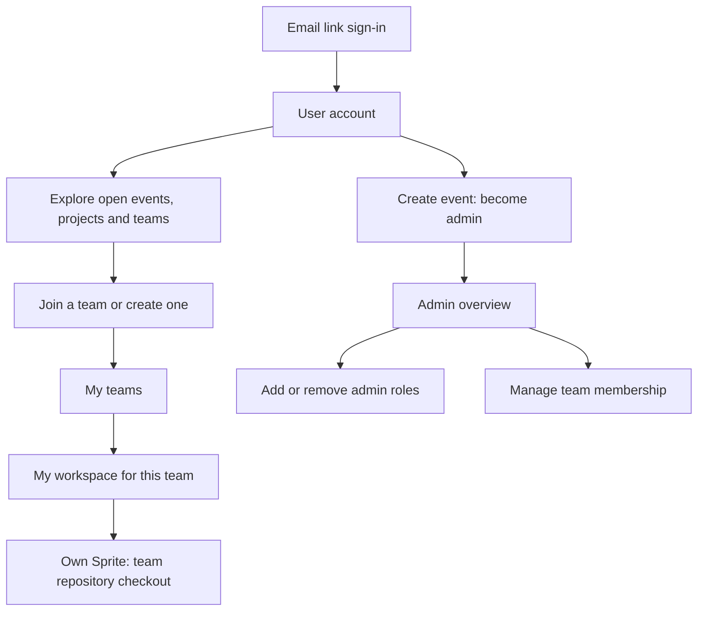

# Accounts, events, teams, and workspaces

## Naming and branding

The repository is `civic-spark` and the provisional platform name is Civic Spark. Participant-facing branding should primarily use the event name, with modest platform identification. Existing `vibehack` runtime/configuration identifiers remain compatible.

## Product model

A **user** normally has a verified email and stable internal identity. The explicit local prototype mode uses the entered email as its identity without verification, with separate data and session cookies. An **event membership** grants member or admin permissions within one event. A **team membership** connects a user to a team; users can have several. A **workspace** belongs to one user/team membership and has its own Sprite and checkout.

## What each person sees

Mobile is a required participant and admin interface. Navigation, event/team management, confirmation dialogs, repository history and restore, browser editing, chat, changes and preview controls should be usable on narrow touch screens and short viewports. Preserve drafts and sessions through responsive layout changes. The terminal remains available with the expected phone keyboard/screen limitations; devices without writable folder access use browser editing or upload/download. Verify phone interactions and both system themes in the browser, while identifying physical iOS/Android keyboard and native-picker checks separately.

| Person | View and permissions |
| --- | --- |
| Signed out | Sign-in page; no event or workspace API data |
| New signed-in user | Open events, projects, existing teams, and create-event option |
| Team member | My teams; join/create additional teams; own private files; shared team changes and ZIP |
| Event admin | Event-wide people/roles/teams/shared work; lifecycle controls; admin grants; team membership removal |

Admin roles do **not** open other people’s private working files. Shared changes and repositories are team-visible. Admins participate through their own team memberships and personal workspaces when they want to work on a project.

### Admin cleanup and repositories

The admin overview groups repository actions by team. **Repository** opens that team's shared `main` history, with paginated commits, per-file diffs and files at a selected commit. Merge commits compare against their first parent. Private workspace commits and non-main refs are not exposed. Previews exclude protected paths and symlinks and limit each text source to 1 MiB; binary and oversized files show an explicit notice.

- **Remove from event** asks for confirmation, then removes the person's event role and all team memberships in this event. Their account, other events, shared history and saved private work remain. The final admin cannot be removed. This is cleanup, not a ban: the person can rejoin an open event and recover their existing workspace.
- **Delete team** asks for confirmation, then removes the team from discovery and revokes its workspace, repository and export access. Team metadata, the bare repository, local files and Sprites are retained for operator recovery. This does not reclaim cloud resources or provide an in-app undelete flow.
- **Copy team** creates a separately named team with the current shared repository, its history and project brief. No members, private workspace files, credentials or private refs are copied. Participants join the new team normally.
- **Restore this version** asks for confirmation and publishes a new commit whose file tree matches the selected shared commit. Existing history remains intact. The operation rejects a stale expected team HEAD; it never resets or force-pushes shared history. Members receive the restore through normal team-update polling, with their private work preserved.
- **Restore this file** recovers just the selected file from a commit where it existed, after confirmation. It creates a new shared commit and preserves every other current file. Large and binary files can be restored even when no text preview is available. A stale team HEAD, excluded path or file/directory collision blocks the restore without changing shared main.

Repository reads require team membership or event-admin access. Copy, deletion, event-member removal and repository restore require that event's admin role. These use the existing local prototype stores and Git transport; hosted durability and coordinated metadata recovery remain separate work.

## Starting an event

1. Configure the installation’s email sender and sign-in origin and workspace provider.
2. Sign in and create an event from a blank or DIOD template. The creator becomes its first admin.
3. Add another admin by the verified email of an account that has signed in, or promote an event member. At least one admin must remain.
4. Open registration. Signed-in newcomers see project briefs and teams.
5. Participants join a team or create a team from a listed project or a custom project title/brief. The creator joins automatically. The chosen brief is checked into `PROJECT.md`.
6. Rehearse the browser → personal workspace → shared contribution → export path before the event.

## Day-of workflow

| Stage | Participant | Admin |
| --- | --- | --- |
| Arrival | Open an email sign-in link and choose the event | Monitor people and teams |
| Find a project | Browse briefs and existing teams; join or create one | Help people find teams; correct mistakes |
| Work | Open My teams, then the workspace for a team | Check event-wide progress and shared changes |
| First workspace visit | Sprite is prepared from that team’s committed repository; subsequent visits resume it | Help with failed provisioning |
| Explore/build | Browse and edit files on the personal Sprite; use an agent or optional terminal | Own files remain private even from the admin view |
| Combine | Review Changes, enter a description, and Share directly to the shared team version | Help resolve conflicts and inspect shared results |
| Finish | Export the shared team ZIP; GitHub publishing is planned | Close editing/joining, preserve work, apply retention policy |

A person can move between several teams without losing their separate workspaces. Removing a team membership revokes that workspace access but does not delete its files. This is membership correction, not banning; rejoining restores the workspace while joining is allowed.

## Required workspace modes

These are accepted requirements with a local prototype implementation. Live file/diff, terminal/runner, and a GLM request with approved SVG creation pass; Claude turns and native folder pickers across supported operating systems still need rehearsal. All modes operate on the same personal workspace and retain its owner-only access rules.

| Mode | Required experience |
| --- | --- |
| Browser | Browse and edit files, inspect changes in flight, and use an integrated Claude or OpenCode agent session |
| Terminal | Advanced users can open a browser terminal in their own Sprite and run the interactive agent CLI or other project tools |
| Local folder | Connect a local folder and edit with a preferred desktop editor, with two-way sync through the browser |

The browser agent UI reuses T3 Code components and layout under MIT. Active turns show T3's elapsed-time header, animated Thinking row or latest-tool label; timers survive browser reconnect, animations follow reduced-motion preferences, and completion/stop/errors remove them. Its model choices are fixed to Opus 5 and GLM. Saved credentials remain distinct from runtime readiness: refresh/reconnect retains their presence, settings hide the key input once saved, and a failed provider connection can retry the saved key or replace it. Provider credentials/model settings also configure the native terminal harnesses inside the personal Sprite; both browser and terminal coding run in bypass-permissions mode.

The browser interface remains the default. Terminal and local editing are optional alternatives; participants do not need local Git or SSH setup. Terminal sessions must support reconnection after a page refresh. Agent and terminal commands execute inside the participant's Sprite, never on the management host.

### Changes in flight

- File browsing uses a compact, hierarchical explorer with expandable folders. The sidebar can collapse and resize, retaining the participant's preference without discarding unsaved edits.
- Light/dark appearance follows the system setting, including live changes. The browser code editor uses Monaco’s full filename/extension catalog while preserving the same save and conflict safeguards. HTML, CSS, JavaScript and TypeScript grammars load with the editor so a failed secondary grammar download cannot leave those files permanently uncolored; other grammars load lazily. HTML includes embedded CSS/JavaScript; major web, data, programming, and configuration files are covered. Vue/Svelte use HTML highlighting and TOML uses the bundled INI approximation; unknown file types remain plain text.
- Show added, modified, and deleted files and a diff against the workspace's last synchronized team version.
- Include saved edits from the browser, local editor, terminal, and agent; refresh the view when files change.
- Preserve unsaved browser edits when another source changes the same file and offer reconciliation.
- Syncing a local folder updates only that person's workspace. Sharing changes with the team remains an explicit, separate action.

### Two-way local folder sync

1. The participant selects **Connect local folder**, chooses a folder, and grants browser read/write permission.
2. Offer a fresh folder for the initial project copy. If the selected folder already has files, show a reconciliation preview before writing; never overwrite them silently.
3. Transfer saved project-file changes in both directions between that folder and the personal Sprite through authenticated VibeHack access.
4. Track the last successful sync and compare both sides against it. Preserve conflicting versions and present a resolution flow when both sides changed a file.
5. Track deletions explicitly. Lost permissions, incomplete directory scans, and disconnected folders must never be interpreted as mass deletions.
6. Exclude `.git`, dependencies, caches, and credentials by default. Git remains managed inside the Sprite; local sync does not require a local Git checkout.
7. Display **Synced**, **Syncing**, **Sync paused**, or **Conflicts**, with file transfer progress. **Sync now** immediately transfers nonconflicting additions/edits; conflicts and deletions require review. Provide a way to disconnect the folder.
8. Support desktop Chrome and Edge on macOS and Windows first, with feature detection and a clear fallback to browser editing and ZIP download/file upload where writable directory access is unavailable. Upload/download is not advertised as automatic two-way sync.
9. Promise sync only while the page is open and active. Reconcile after a suspended tab resumes, a network reconnects, or permission is restored. Reliable sync after the browser closes would require an optional local helper, outside the initial browser-sync requirement.

Browser directory permissions enable this design but do not provide a synchronization engine; VibeHack must implement comparison, transfer, conflicts, and recovery. Recheck browser compatibility during implementation. [File System Access API](https://developer.chrome.com/docs/capabilities/web-apis/file-system-access), [directory picker support](https://developer.mozilla.org/en-US/docs/Web/API/Window/showDirectoryPicker)

Acceptance includes local-to-Sprite and Sprite-to-local edits, new files, deletions, simultaneous edits, unsaved browser edits, interrupted transfers, permission revocation, tab suspension/resume, excluded files, and cross-workspace access denial. Verify the supported macOS/Windows browser combinations and the fallback experience before claiming support.

## Implementation and next steps

Implemented: account/session integration, event roles, discovery, multi-team membership, custom briefs, own-file authorization, local Git collaboration, actual Sprite file browsing/editing, and ZIP export. Sender credentials and a real inbox-delivery rehearsal are still needed. With cloud workspaces enabled, first opening a workspace prepares its Sprite. Local mode uses the same authorization rules for automated development tests.

Remote file edits are live. Integrated agent adapters, reconnectable terminals, changes-in-flight views, and browser folder sync now have prototype implementations. Remote Share publishes directly through authenticated Git bundle transfer. Remote pull is implemented through Git bundles with explicit conflict resolution. Hosted Git/mTLS, durable jobs, isolated integration checks, hosted/shared app previews, enforced budgets, publication, and operational recovery remain future work. Local merges never run participant code on the management host.

## Hosting boundaries

First deployment target: portal/API/auth and durable metadata on a Fly Machine; Git repositories on durable storage; one Sprite per user/team membership; later an integration Sprite per team. The Git service uses a configurable HTTPS address with event-scoped client certificates. Fly private networking is optional, not required. See [portability](portability.md) and [Git access](git-and-access.md).

Personal web previews and agent environment/Git commands now have a local prototype implementation; see [workspace integration contracts](workspaces.md#agent-project-guidance-and-environment-commands). Agents use the current project brief and configured command/port, preserve existing static apps, ask for explicit confirmation before publishing the current changes, and require separate confirmation before resolving publication conflicts. Hosted preview exposure remains a configuration/deployment decision.
